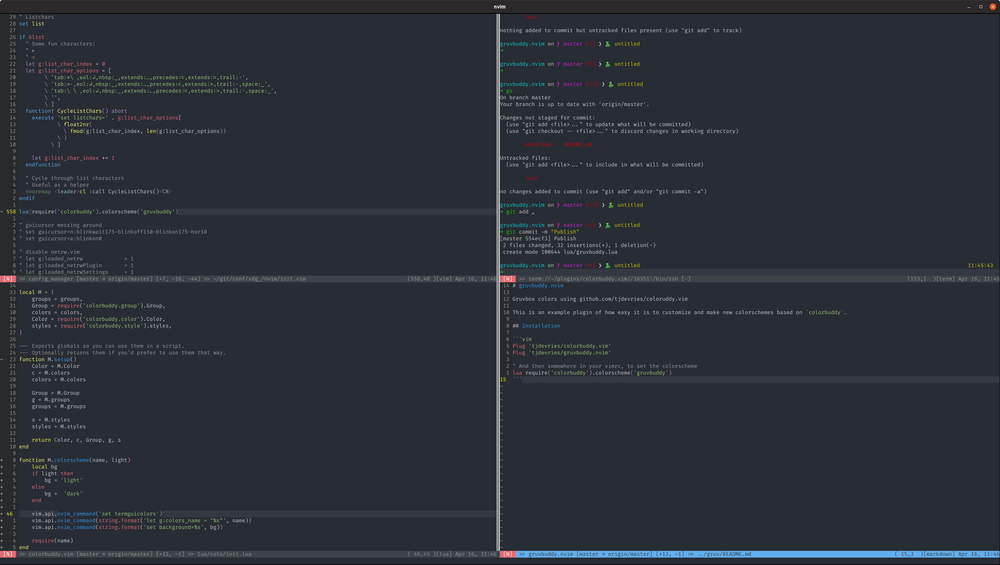

# gruvbuddy.nvim

Gruvbox-esque colors using [tjdevries/colorbuddy.vim](https://github.com/tjdevries/colorbuddy.vim)



This plugin is also an example of how easy it is to customize and make new colorschemes based on `colorbuddy`.

Check out `lua/gruvbuddy.lua`

## Installation

```vim
Plug 'tjdevries/colorbuddy.vim'
Plug 'tjdevries/gruvbuddy.nvim'

" And then somewhere in your vimrc, to set the colorscheme
lua require('colorbuddy').colorscheme('gruvbuddy')
```
